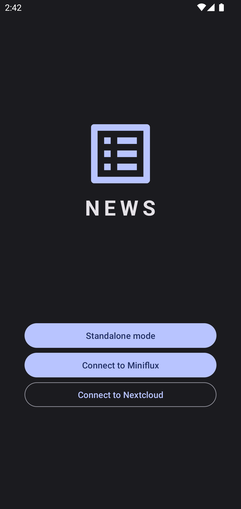

# News for Nextcloud

  
  

📰 **Feed Reader** and 🎧 **Podcast Player** for **Nextcloud** ☁️ *(unofficial)*

---

---

## ✨ Main Features:

- Subscribe to your favorite RSS and Atom feeds
- Sync with your personal Nextcloud News server
- Smooth and snappy user experience even on the older and cheaper devices
- Built-in podcast fetcher which can be used with external players
- Enhance your news feed with high-resolution preview images
- Enjoy modern and minimalistic Material Design
- Both light and dark color schemes are supported
- This is an open source app which respects your privacy

---

## ⚠️ Notes on Standalone Mode
The standalone mode is still work in progress, which means it's not reliable at the moment. You're welcome to test it out and leave your feedback.

## 🌍 Translators Needed

https://crwd.in/news-android

## 💸 Fund the Project

Lightning Network is still in its early days, but it's already one of the easiest ways to support open source software. Distribution and payments are pretty much monopolized, leaving developers vulnurable to deplatforming, not to mention the exorbitant fees they chagre. LN fixes the payment side and F-Droid fixes distribution. I believe it's a good combo for an Android app.

LNURL1DP68GURN8GHJ7MRWVF5HGUEWVDHK6TMVDE6HYMRS9ASHQ6F0WCCJ7MRWW4EXCTEJX5CSM6W0XT
