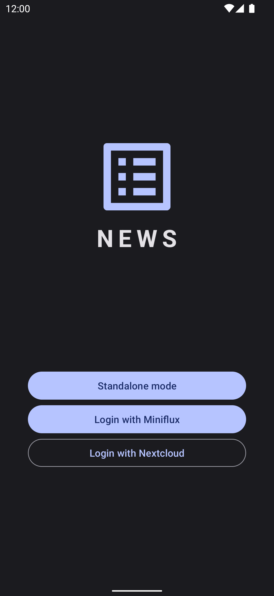
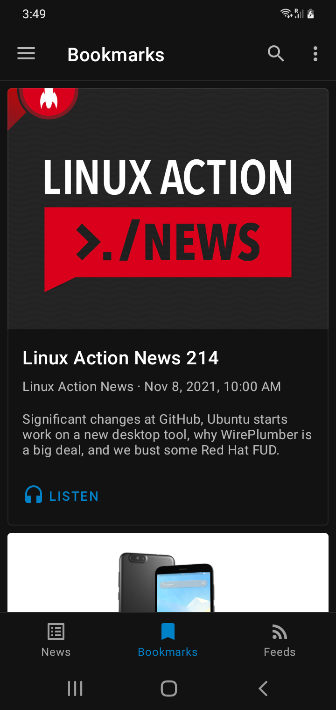
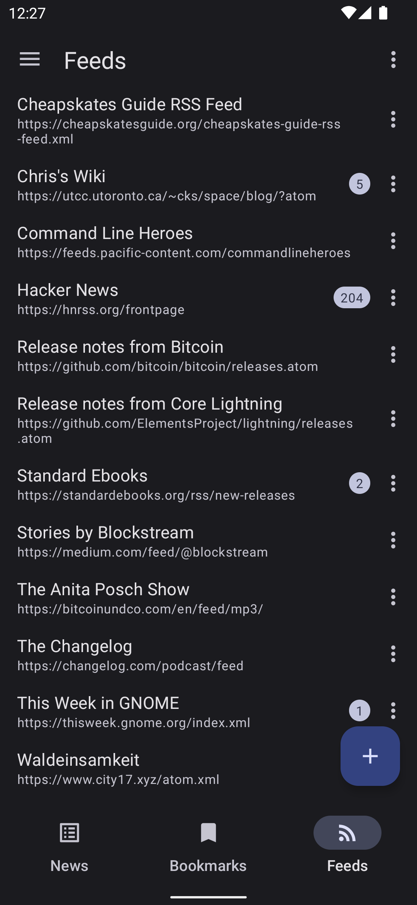

# News

  
  

📰 Feed Reader and 🎧 Podcast Player for Android

Using a server is optional and it currently it supports the following servers:

- Miniflux
- Nextcloud

---

---

## ✨ Main Features:

- Subscribe to your favorite RSS and Atom feeds
- Sync with your personal Miniflux or Nextcloud server
- Smooth and snappy user experience even on the older and cheaper devices
- Built-in podcast fetcher which can be used with external players
- Enhance your news feed with high-resolution preview images
- Enjoy modern and minimalistic Material Design
- Both light and dark themes are supported
- This is an open source app which respects your privacy

---

## ⚠️ Notes on Standalone Mode
The standalone mode is still work in progress, which means it's not reliable at the moment. You're welcome to test it out and leave your feedback.

## 🌍 Help Us Translate

- [Afrikaans](app/src/main/res/values-af/strings.xml)
- [Arabic](/app/src/main/res/values-ar/strings.xml)
- [Catalan](/app/src/main/res/values-ca/strings.xml)
- [Chinese](/app/src/main/res/values-zh/strings.xml)
- [Czech](/app/src/main/res/values-cs/strings.xml)
- [Danish](/app/src/main/res/values-da/strings.xml)
- [Dutch](/app/src/main/res/values-nl/strings.xml)
- [English](/app/src/main/res/values/strings.xml)
- [Finnish](/app/src/main/res/values-fi/strings.xml)
- [French](/app/src/main/res/values-fr/strings.xml)
- [German](/app/src/main/res/values-de/strings.xml)
- [Greek](/app/src/main/res/values-el/strings.xml)
- [Hebrew](/app/src/main/res/values-iw/strings.xml)
- [Hungarian](/app/src/main/res/values-hu/strings.xml)
- [Italian](/app/src/main/res/values-it/strings.xml)
- [Japanese](/app/src/main/res/values-ja/strings.xml)
- [Korean](/app/src/main/res/values-ko/strings.xml)
- [Norwegian](/app/src/main/res/values-no/strings.xml)
- [Persian](/app/src/main/res/values-fa/strings.xml)
- [Polish](/app/src/main/res/values-pl/strings.xml)
- [Portuguese](/app/src/main/res/values-pt/strings.xml)
- [Romanian](/app/src/main/res/values-ro/strings.xml)
- [Russian](/app/src/main/res/values-ru/strings.xml)
- [Serbian](/app/src/main/res/values-sr/strings.xml)
- [Spanish](/app/src/main/res/values-es/strings.xml)
- [Swedish](/app/src/main/res/values-sv/strings.xml)
- [Turkish](/app/src/main/res/values-tr/strings.xml)
- [Ukrainian](/app/src/main/res/values-uk/strings.xml)
- [Vietnamese](/app/src/main/res/values-vi/strings.xml)

Didn't find your language or regional dialect? Open an issue and we'll add it.
